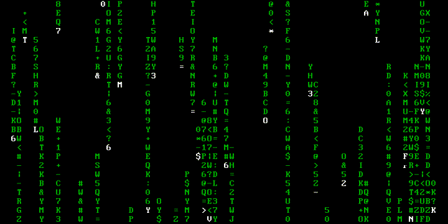
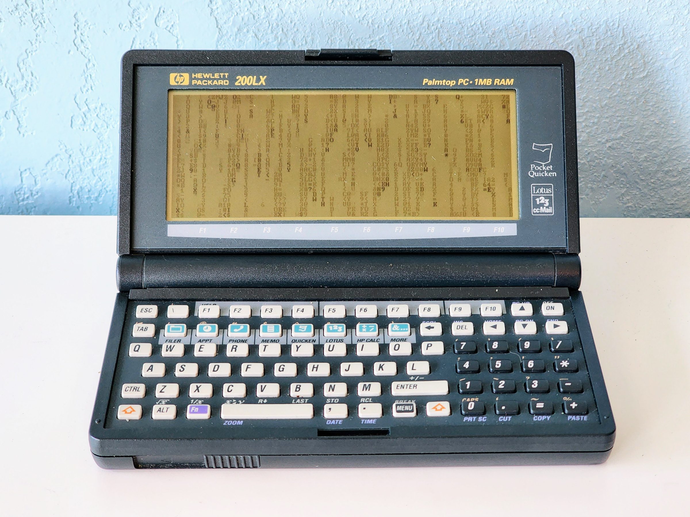

# r41n

The iconic digital rain effect from _The Matrix_ series, in ~700 bytes of 8086 assembly.

In DOSBox:

On an [HP 200LX](https://en.wikipedia.org/wiki/HP_200LX):

## 8086 assembly

The implementation can be found in [./asm](https://github.com/jichu4n/r41n/blob/master/asm/), and includes two variants targeting the 8086 and the 80186 respectively.

To build, use the [flat assembler (fasm)](https://flatassembler.net/). The result is a 16-bit executable that can run on MS-DOS, early versions of Windows (up to XP), and in DOSBox.

## TypeScript

A TypeScript implementation for Node.js is included in [./ts](https://github.com/jichu4n/r41n/blob/master/ts/).
